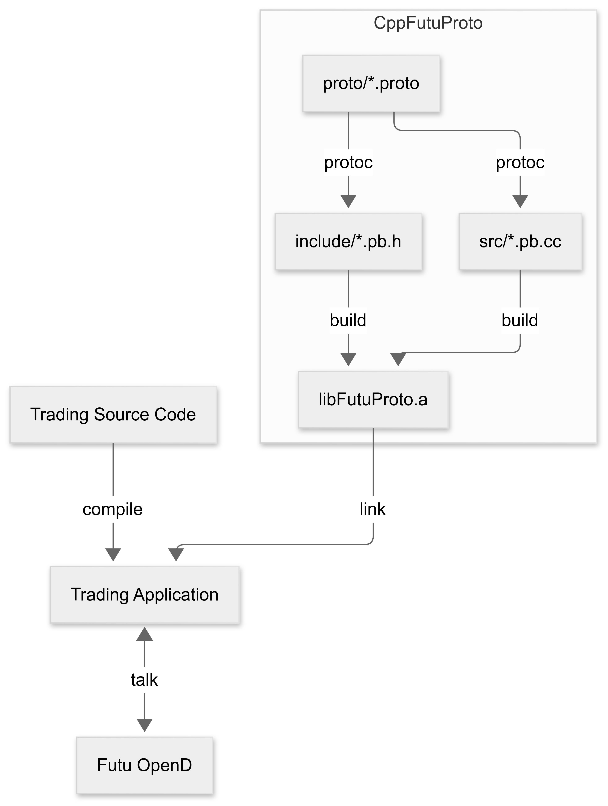
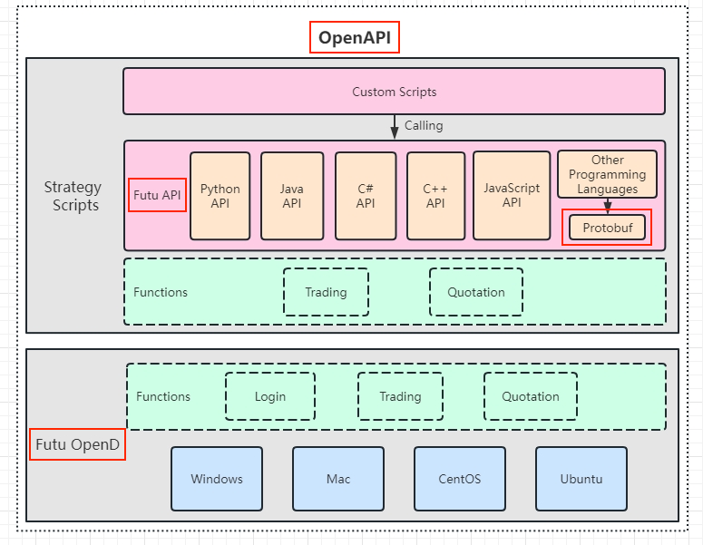

# CppFutuProto

*A standalone C++ library for the protobuf part of Futu API.*

- [Why](#why)
- [Supported Platforms](#supported-platforms)
- [Build](#build)
- [Project Structure](#project-structure)
- [Versions](#versions)
- [Disclaimer](#disclaimer)

This repository provides a standalone C++ static library (`libFutuProto.a`) for
the protobuf part of Futu API. It includes all necessary inputs and generated
outputs for a CMake-based build process. The library is designed to serve as a
well-separated, self-contained component for any C++ application trading on
Futu, helping developers better understand and analyze communication using Futu
protocols.

<p align="center"></p>

*Futu API is a [protobuf](https://protobuf.dev)-based SDK that communicates with
Futu OpenD, Futu's gateway program. Together, they form the Futu
[OpenAPI](https://openapi.futunn.com/futu-api-doc/en/intro/intro.html),
enabling programmatic trading on [Futu](https://www.futunn.com/en). In short,*

```
Futu OpenAPI = Futu API + Futu OpenD
```



*^ Original image from the website of [Futu API Doc](https://openapi.futunn.com/futu-api-doc/en/intro/intro.html).*

## Why

Compared to Futu C++ API's bundled all-in-one package(interfaces, communication,
samples), this project:

1. Focuses exclusively on the protocol buffer communication layer, facilitating
code comprehension;
2. Provides a complete set of build inputs and generated outputs for full
transparency;
3. Configures CMake to export `compile_commands.json`, enabling seamless
integration with [clangd](https://clangd.llvm.org/).

## Supported Platforms

- MacOS
- Linux

The build process has been tested on

- macOS Sequoia 15 (ARM64)
- Ubuntu 24.04 (x64)

## Build

You don't have to build anything on your own. The output of this repo is either
shipped with the source code or can be found in the
[release](https://github.com/aafulei/cpp-futu-proto/releases) page. But if you
wish to build from `.proto` source files, here are the steps:

```shell
# clone this repository
git clone https://github.com/aafulei/cpp-futu-proto.git

# fetch protobuf submodule
git submodule update --init --recursive

# build protoc v3.5.1 from source
cd protobuf
./autogen.sh
./configure
make -j
make check  # optional
cd ..

# if you wish to regenerate .pb.h and .pb.cc from .proto files
rm -rf include src

# build libfutuproto.a, regenerating .pb.h and .pb.cc files if needed
mkdir build && cd build
cmake ..
make -j
```

## Project Structure

- [`docs/`](./docs/) - Project documentation files
- [`include/`](./include/) - C++ headers generated from `.proto` definitions
- [`proto/`](./proto/) - `.proto` definitions for Futu API, version 9.2.5208, released on 2025-04-17
- [`protobuf/`](https://github.com/protocolbuffers/protobuf/tree/106ffc04be1abf3ff3399f54ccf149815b287dd9) - (submodule) Google's protobuf, version 3.5.1, released on 2017-12-20
- [`src/`](./src/) - C++ source files generated from `.proto` definitions
- [`CMakeLists.txt`](./CMakeLists.txt) - CMake configuration that generates Makefiles for Make to build project

## Versions

- *Futu API* (as part of Futu OpenAPI) - version 9.2.5208, released on
2025-04-17, which requires:
  - *Protobuf* - version 3.5.1, released on 2017-12-20
- *CMake* - set to require version 3.10, released on 2017-11-20, or newer.
Version 4.0, released on 2025-03-28, or newer is recommended.
- *C++* - GNU C++14

*The above version of Futu API is
[said](https://github.com/FutunnOpen/py-futu-api/issues/184#issuecomment-2481795261)
to be compatible with any 3.x versions of protobuf.*

## Disclaimer

This project is developed solely as a personal/community effort and is not
affiliated with or endorsed by Futu or any of its subsidiaries. Use this code
at your own risk.

All `.proto` files included in this repository are provided by Futu and remain
the intellectual property of Futu. The `CMakeLists.txt` and related build
configurations, as well as any additions or modifications made by the author,
are released under the [MIT License](./LICENSE).
